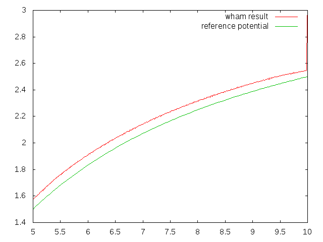

Qahwa
====

A tool for WHAM.

Fig.1 : The umbrella sampling trajectory


Fig.2 : The result of wham



## Build

Use `git clone` and `cmake`. The binary will be in `bin/` directory.

```sh
$ git clone https://github.com/ToruNiina/qahwa.git --recursive
$ cd build
$ cmake ..
$ make
```

## Usage

### Reaction Coordinate and PerturbingPotential

To use Qahwa, you need to write really short c++ code to calculate your
Reaction Coordinate and Perturbing Potential from SnapShot.

`SnapShot` is an alias of `std::vector<Vector3d>`, and `Vector3d` is
normal 3-dimentional vector defined in AX library.

You can access the position of i-th particle like this way.

```cpp
SnapShot snapshot;
Vector3d position = snapshot.at(i);
```

And the AX library provides you some useful functions for vectors. like

```cpp
// qahwa c++ code
Vector3d position(0.0, 1e0, 1.5e2);
Vector3d another_position = snapshot.at(i);
double   l  = length(position);
double   l2 = len_square(position);
double   dot = dot_prod(position, another_position);
Vector3d cross = cross_prod(position, another_position);
```

By default, the harmonic anchor is implemented as PerturbingPotential and
distance between first 2 particle is implemented as ReactionCoordinate.

See `src/UserDefinedFunction.(h|c)pp`.

### Command line interface

Qahwa has several modes.

```sh
$ qahwa --wham input.toml
```

| mode             | input file | description                                                         |
|:-----------------|:-----------|:--------------------------------------------------------------------|
| --make-histogram | dcd file   | make histogram from one dcd file(all the values are set as default) |
| --make-histogram | toml file  | make histogram from several dcd file                                |
| --make-unbiased  | toml file  | make unbiased histogram of each trajectories (not connected)        |
| --make-pmf       | toml file  | make potential of mean force from probability density function      |
| --wham           | toml file  | run wham and output weighted unbiased histogram of the trajectories |

### input file

Qahwa uses TOML format for input files.

The typical example is described below.

```toml
[histogram]
dcdfiles   = ["traj1.dcd", "traj2.dcd", "traj3.dcd"]
output     = "histogram"

[unbiased]
dcdfiles   = ["traj1.dcd", "traj2.dcd", "traj3.dcd"]
parameters = [
    [1.0, 1.0, 5.0, 0.0, 0.0],
    [1.0, 1.0, 5.5, 0.0, 0.0],
    [1.0, 1.0, 6.0, 0.0, 0.0]
]
output     = "unbiased"

[wham]
dcdfiles   = ["traj1.dcd", "traj2.dcd", "traj3.dcd"] # required
parameters = [
    [1.0, 1.0, 5.0, 0.0, 0.0],
    [1.0, 1.0, 5.5, 0.0, 0.0],
    [1.0, 1.0, 6.0, 0.0, 0.0]
] # required
bins        = 200    # default is 100.
temperature = 300.0  # default is 300.0
output      = "wham" # output filename. required
```

`dcdfiles` is a list of `./path/to/filename`s.

`parameters` is the list of parameters,
and parameters are represented as a list of floating-point number
(TODO: use table format).
The first element represents index of anchored particle (!!)
and the second element represents a coefficient of anchor.
The last 3 element represents anchor position(3d-vector).
`output` is a name of the file to output.

Qahwa reads only the table that is related to the mode. For example, if you run
Qahwa with option --make-unbiased, `[histogram]` and `[wham]` tables are ignored.

## Licensing terms

This project is licensed under the terms of the MIT License.
See LICENSE for the project license.

- Copyright (c) 2016- Toru Niina

All rights reserved.
